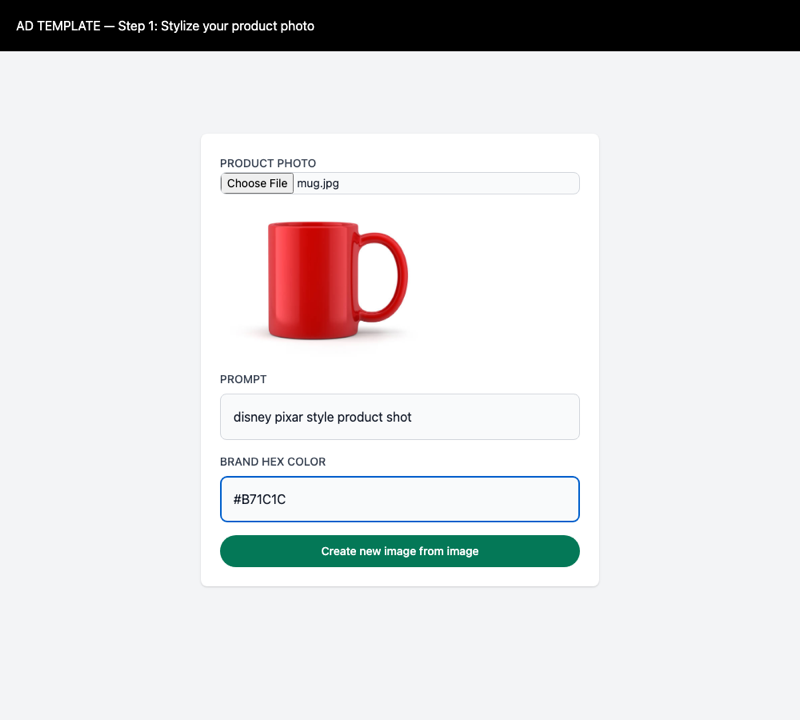
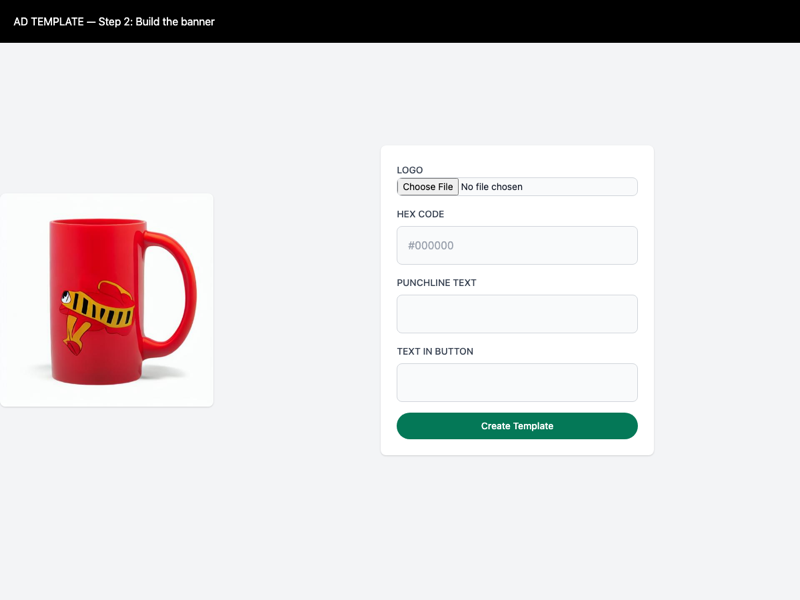
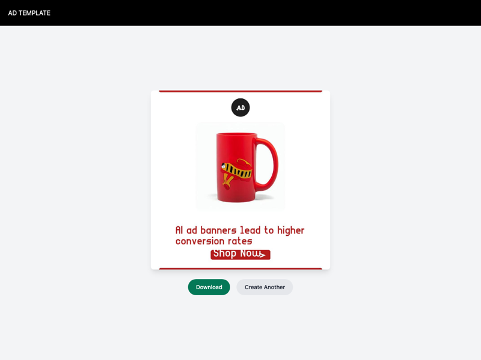

# AI Ad Template Generator

A two-step tool for turning a plain product photo into a branded ad banner: Stable Diffusion restyles the photo, then a compositing step lays out a logo, a colored call-to-action button, and punchline text around it.

**Step 1 — stylize** | **Step 2 — build the banner** | **Result**
:---: | :---: | :---:
 |  | 

**Stack:** FastAPI · Stable Diffusion (img2img, via `diffusers`) · Pillow · scikit-learn (color-name model)

## How it works

1. **Upload a product photo + prompt + brand hex color** (`/getimg2img`). The hex color is resolved to a human-readable name — an exact match against a [1,300-color name table](app/ml_color/color_names.csv), falling back to a small trained classifier (`app/ml_color/base_model.joblib`) for anything not in the table — and appended to the prompt (e.g. `"disney pixar style, Firebrick"`). That prompt drives a Stable Diffusion img2img pass over the uploaded photo.
2. **Upload a logo + punchline + button text** (`/output_template`). This composites the stylized image from step 1 with the logo, a button recolored to the brand hex, and punchline text into an 800x800 banner, returned as a downloadable image.

## Setup

```bash
python3 -m venv .venv
source .venv/bin/activate

pip install -r requirements.txt
python app/main.py
```

Open `http://localhost:8000`. The Stable Diffusion weights (~460MB, fp16) download on first use of step 1, not at startup — every other route works immediately without them.

**Hardware:** picks CUDA, then Apple Silicon (MPS), then CPU automatically. Step 1 takes ~25s on an Apple M-series GPU; expect several minutes on CPU-only.

## Running tests

```bash
pip install -r requirements.txt
cd app
pytest
```

The diffusion pipeline is mocked in tests — they don't download or run the model.

## Notes

- The safety checker is disabled (`safety_checker=None`) to keep the model lighter. Per the Stable Diffusion license, don't expose unfiltered output in a public-facing service without your own moderation.
- `app/ml_color/base_model.joblib` was pickled with an older scikit-learn; it still loads and predicts correctly but prints a version-mismatch warning. Harmless, but a candidate for retraining if scikit-learn removes backward compatibility for this pickle format.
